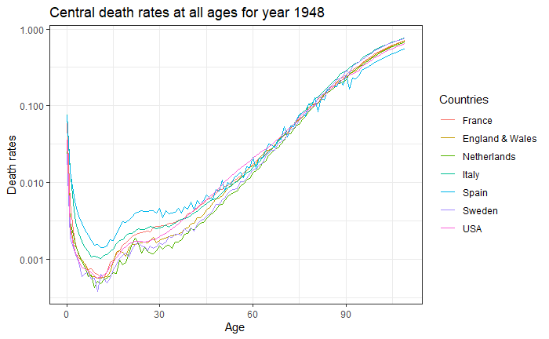
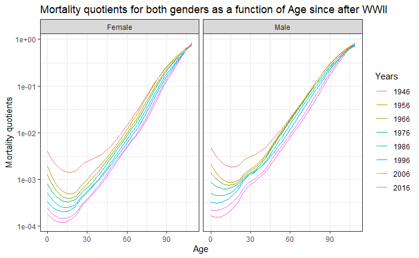

class: inverse, center, middle


# Introduction


* Item 1
* Item 2
    + Item 2a
    + Item 2b
  

---
class: inverse, center, middle
    
# Central death rates at all ages for year 1948


```{r echo=FALSE}

```


---
class: inverse, center, middle
# Mortality quotients for both genders as a function of Age since after WWII


---
class: inverse, center, middle

```{r echo=FALSE}

```

<!-- -- -->

<!-- <br> -->
<!-- <br> -->

<!-- This will appear on click but a bit farther away -->

---
class: inverse, center, middle


```{r echo=FALSE}
knitr::include_graphics("images/Mortality quotients for both genders facetted.jpg")
```
---

class: inverse, center, middle

#Ration between central death rates in European countries and central death rates in the USA in 1948

```{r echo=FALSE}
knitr::include_graphics("images/Ration between Europe and usa.jpg")
```

---
class: inverse, center, middle

#PCA 

```{r echo=FALSE}
knitr::include_graphics("images/pca3.jpg")
```

---
class: inverse, center, middle

#PCA 

```{r out.width="450px", fig.height=5,echo=FALSE}
knitr::include_graphics("images/pca1.jpg")
knitr::include_graphics("images/pca2.jpg")

```
