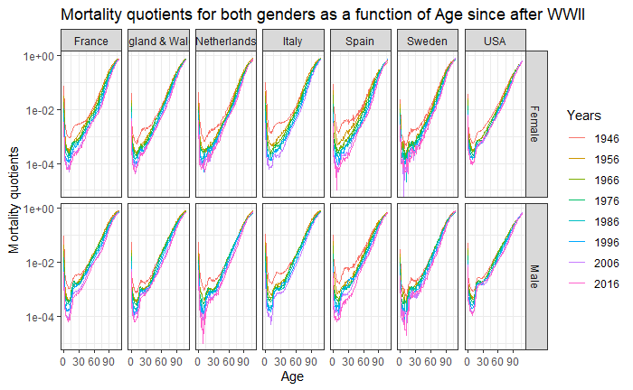
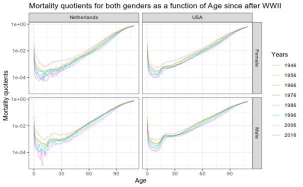
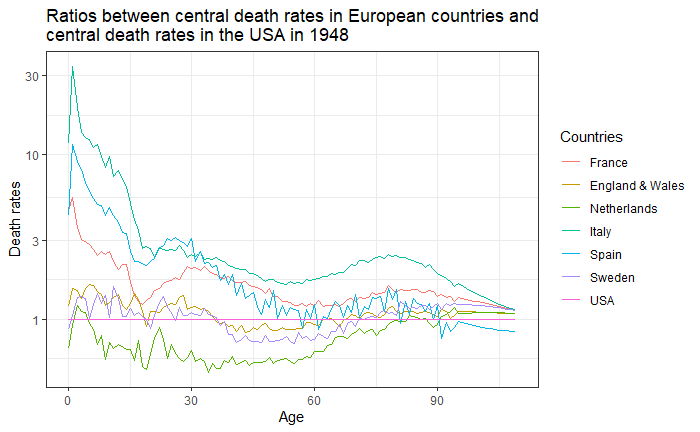
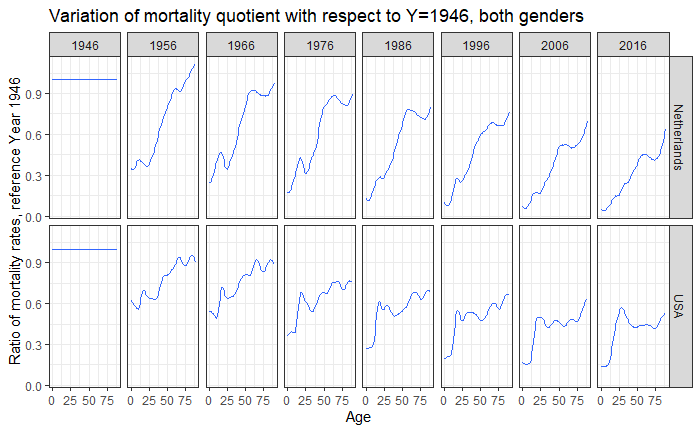
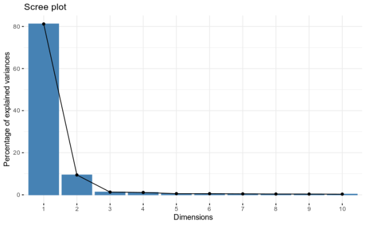
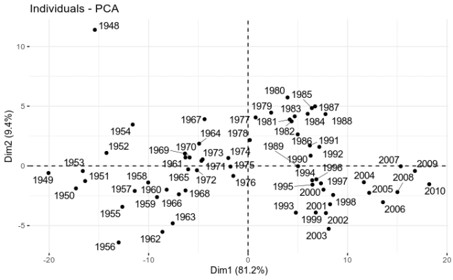
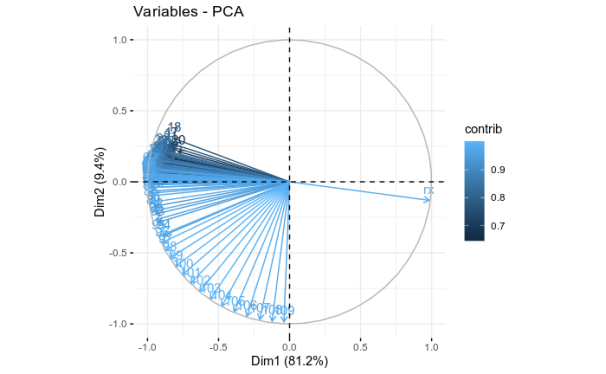

# Introduction


* Item 1
* Item 2
    + Item 2a
    + Item 2b

---
class: inverse, center, middle
# Mortality quotients for both genders as a function of Age since after WWII


---
class: center, middle

```{r echo=FALSE}

```

<!-- -- -->

<!-- <br> -->
<!-- <br> -->

<!-- This will appear on click but a bit farther away -->

---
class: center, middle

```{r echo=FALSE}

```
---
class: inverse, center, middle

#Ration between central death rates in European countries and central death rates in the USA in 1948

---
class: center, middle

```{r echo=FALSE}

```

---
class: center, middle

```{r echo=FALSE}


```

---
class: inverse, center, middle

#PCA 

---
class: center, middle

```{r echo=FALSE}

```

---
class: center, middle
#PCA 

```{r out.width="450px", fig.height=5,echo=FALSE}



```
---
class: inverse, center, middle

#Lee-Carter model

---
class: center, middle

---


